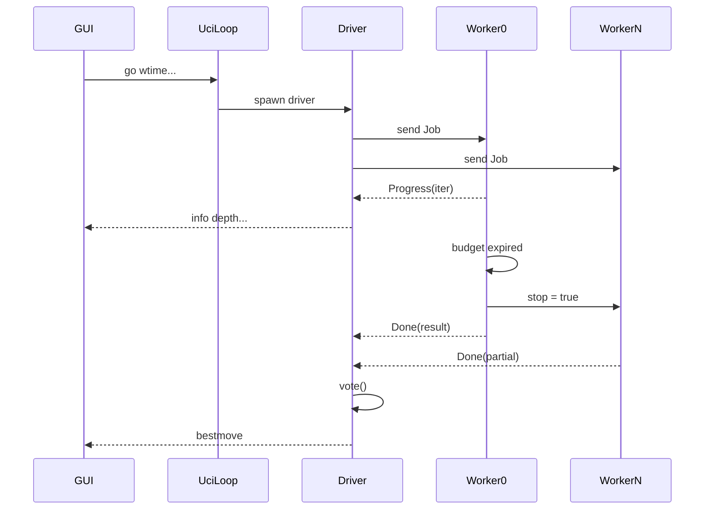

## Lazy SMP (M5) — Multi-Thread Search Support

For SMP-enabled searches, N workers run independent iterative-deepening searches on the same root, sharing only the transposition table. Divergence comes from TT races plus aspiration jitter; the root move is chosen by score-weighted voting. Public UCI `go depth N` is deliberately excluded: it dispatches only worker 0 so helper TT writes cannot perturb deterministic fixed-depth output.

Sequenced **before** M4 history work, with a `HistoryTables` seam so M4 slots in without touching threading code. This also resolves a conflict: M4 Phase 0 proposed deleting the `Threads` option, but `uci_protocol.rs:302` asserts it is advertised.

### Concurrency contract

- **Search hot path is lock-free.** Only relaxed atomics: TT (already), `AtomicBool` stop, per-worker `AtomicU64` node counters. No lock is held while searching.
- **Dispatch/park uses `std::sync::mpsc`.** Workers block in `recv()` — parked threads sleep rather than spin. std-only, consistent with `mf-search` having zero external dependencies.
- **Only worker 0 owns the clock** and calls `Instant::now()`, behind a 512-node counter. Helpers read only `stop`.
- **Only worker 0 emits `info`.** Required by `uci_protocol.rs:653`, which asserts exactly 6 info lines for `go depth 6`.
- **Public UCI fixed-depth search is single-worker.** `go depth N` leaves helpers parked and uses worker 0 only. A separate explicit fixed-depth SMP entry point exists solely for `mtbench` scaling measurements.
- All UCI writes stay on the driver thread. Workers never touch stdout.
- No new `unsafe`. Under `panic = "abort"` a worker panic kills the process, so all worker indexing must be provably in-bounds.



### Phase 0 — TT generation and aging

All 7 store sites hardcode `age: 0`, so `relative_age` is permanently 0 and replacement has degenerated to depth-preferred. With N threads filling the TT N× faster this gets materially worse.

- Add `generation: u8` to `SearchContext`, incremented once per `go`, threaded to every store site.
- Parallel `TranspositionTable::clear()` striped across workers. `clear()` already takes `&self`, so this needs no signature change. **Justification is `ucinewgame` wall-time on a large table**, not NUMA — this is a single-socket machine and NUMA is out of scope.

Bench signature changes here. Record it; it becomes the reference for all later phases.

### Phase 1 — `HistoryTables` seam (`crates/mf-search/src/history.rs`)

Pure refactor. Move `killers` and `quiet_history` out of `SearchContext` behind a narrow interface:

```rust
pub(crate) struct HistoryTables { /* killers, quiet_history */ }

impl HistoryTables {
    fn new(threads: usize) -> Self;   // sizing hook: BASE * next_pow2(threads)
    fn killers(&self, ply: usize) -> [Option<Move>; 2];
    fn record_killer(&mut self, ply: usize, mv: Move);
    fn quiet_score(&self, color: Color, mv: Move) -> i32;
    fn update_quiet(&mut self, color: Color, mv: Move, bonus: i32);
    fn clear(&mut self);
}
```

`static_evals`, `current_moves`, and `repetition_history` stay in `SearchContext` — they are per-ply search stack, not history.

**Gate: bench node count bit-identical to Phase 0.** Any delta is a bug.

### Phase 2 — Worker parameterization (still single-threaded)

- `SearchContext` gains `worker_id: usize` and owns its `HistoryTables`.
- Aspiration jitter: `ASPIRATION_INITIAL_DELTA + jitter(worker_id)`. Stockfish uses `5 + idx % 8`; our base is 25, so a raw `% 8` is a proportionally weaker perturbation. **The jitter scale is a measured parameter, screened in Phase 5, not copied verbatim.**
- Clock checks move behind a 512-node counter, gated on `worker_id == 0`.
- Node counting: local `u64` published to a per-worker `AtomicU64` every 1024 nodes. Node-limit checks sum the published counters.

**Gate: bench bit-identical again.** At `worker_id == 0` jitter is `+0` and the aggregate equals the local counter.

### Phase 3 — Persistent worker pool (`crates/mf-search/src/thread_pool.rs`)

- Pool created on demand and resized only on `setoption name Threads`; never respawned per `go`.
- Each worker owns a `Receiver<Job>`; dropping the sender terminates it cleanly.
- `Job` carries `Arc<TranspositionTable>`, the root `Position`, the history key slice, limits, options, and generation. Each worker builds its own `RepetitionHistory` via `new(&position, &history)` — it does not derive `Clone`.
- Worker 0 sends `Progress(IterationInfo)`; all workers send `Done(WorkerResult)`.
- **Helpers run without time limits** and exit on `stop`. Depth and node limits are shared.
- The pool exposes distinct fixed-depth entry points: the UCI path dispatches only worker 0, while the explicitly named SMP fixed-depth path dispatches all workers for `mtbench`.
- `mf-uci` keeps its existing per-`go` driver thread (one spawn, not N) so the reader loop stays responsive and the diff to `mf-uci` stays small. `Threads` now resizes the pool instead of writing dead state.
- `bench` pins `Threads=1` so its exact node fingerprint stays meaningful.

### Phase 4 — Best-thread voting (`crates/mf-search/src/vote.rs`)

Pure, unit-testable functions per research §6.2:

- `votes[pv[0]] += score - min_score + 14`.
- Decisive scores override the vote; shortest mate wins among them.
- Ties broken by longer PV. Score-only weighting — the `completedDepth` dependency was removed upstream in `9449162d58`.
- **Workers with `depth == 0` are excluded** — they fall back to `evaluate()` with an arbitrary move and would pollute the tally. If every worker is depth 0, use worker 0's fallback.
- **If the vote selects a worker other than 0, emit one final `info` line** for the selected result so the GUI's last info matches `bestmove`.

At `Threads=1` voting is the identity function and emits no extra line, preserving the exact-6-info-lines assertion.

### Phase 5 — Validation

**Correctness gates**

1. `Threads=1` bench bit-identical to the Phase 0 signature.
2. `cargo test --workspace`, `cargo clippy --workspace --all-targets -- -D warnings`, `cargo test -p mf-core --features force-magic`.
3. Existing tests that become live SMP coverage once `Threads` is wired: `quit_during_infinite_search_exits_cleanly` (already `Threads=4`), `infinite_overrides_depth_and_node_limits_until_stop`, `hashfull_is_monotone_and_reported_in_per_mille`.
4. New UCI regression test: repeat the same `Threads > 1` plus `go depth N` request and assert identical deterministic `info` fields and `bestmove`, proving helpers stayed parked. Canonicalize away machine-dependent `time` and `nps` fields before comparing `info`.
5. New `smp_stress` integration test: repeated 8-thread searches over many positions asserting legal `bestmove`, legal PV, no panic, monotone aggregate nodes, and clean `stop` within a bounded deadline.
6. New unit tests for `vote()` covering the depth-0 exclusion, decisive override, shortest-mate preference, and PV-length tiebreak.
7. `Threads=1` non-regression SPRT vs the pre-SMP baseline — proves the refactor is free.

**SMP measurement** (research is explicit: never tune SMP at STC)

7. `mtbench`: nps and time-to-depth at 1/2/4/8 threads, fixed depth, `Hash=64`.
8. Fixed-node equivalence: 8t vs 1t at equal node budget should be near-equal strength. A large gap is a bug, not scaling.
9. **8t vs 1t Elo at `tc=60+0.6`**, `-concurrency 1 -use-affinity`, `UHO_Lichess_4852_v1.epd`, ~200 games for a ±25 Elo interval. Stockfish measures +178.6 ± 14.0 at 8t, so even a wide interval is decisive. Budget ~9 hours wall time.
10. Aspiration-jitter scale screened on the `mtbench` scaling curve before the Elo run.

Below ~60% parallel efficiency at 8 threads is treated as a bug and investigated before merge.

### Deliverables

- `docs/superpowers/specs/2026-07-30-m5-lazy-smp-design.md`, committed first.
- Per-phase commits in repo style (short imperative sentence-case subjects, bench signature deltas in the body).
- `experiments/M5-smp/` with `run-metadata.txt`, exact fastchess commands, and the scaling table.
- `baselines/M5/manifold.exe` + `build-metadata.txt`.
- Node-count testing rule retained in this tracked design and the implementation plan: exact node-count assertions, `bench`, and deterministic node-budget tests must explicitly use `Threads=1`.

### Out of scope

M4 history tables (pawn/capture/continuation/correction), shared-across-threads history, NUMA binding, huge pages, NNUE, MultiPV, ponder, `searchAgainCounter`, and the obsolete `SkipSize`/`SkipPhase` depth-skew tables.

### Known behavior changes

- `go nodes N` overshoots slightly at `Threads > 1` (1024-node publish granularity). Exact at `Threads=1`.
- Time-limit precision becomes ~512 nodes (≈0.3 ms at current nps) instead of per-node.
- SMP-enabled search results are non-deterministic at `Threads > 1` by construction. Public UCI `go depth N` remains deterministic because it dispatches only worker 0.